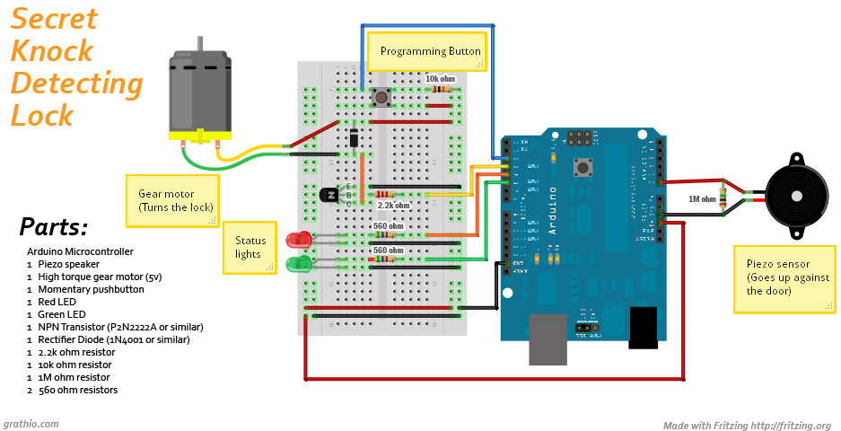
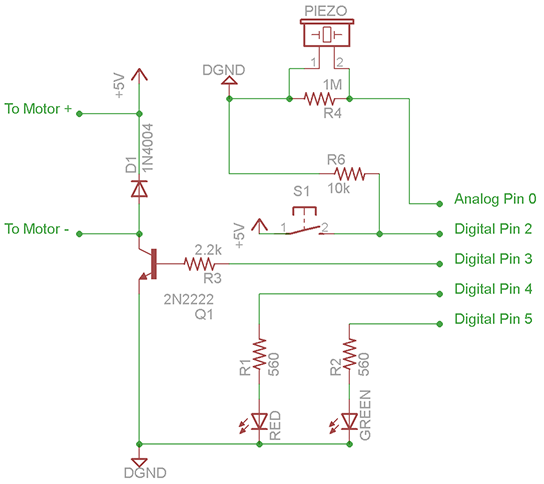
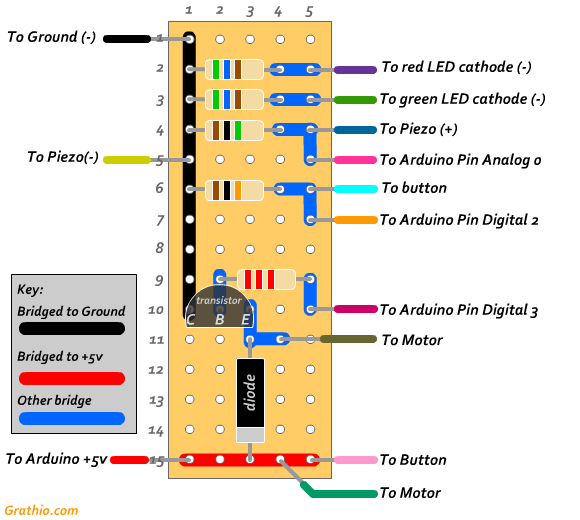

<h1 align="center">Door Sensor of Secret Knocks</h1>

#### Protect your secrets from intruders with a lock that will only open when it hears the secret intervals of knocks.

 

#### Author: [FeoN_](https://github.com/FeoN-17?tab=repositories)

#### Platform: [Arduino](https://www.arduino.cc/)

#### License: [CC BY-NC-SA 3.0 US](LICENSE)

#### Idea source and images: By [Steve Hoefer](https://www.instructables.com/Secret-Knock-Detecting-Door-Lock/) ( from [Grathio Labs](http://grathio.com/) )

 

---
 
 

### WORKING MODES

___

* #### Validating: use knocks to validate with secret code
* #### Programing: use knocks to set new secret knocks intervals pattern

 
 

### EDITABLE
___

* All pins
* `Timer: 50 default`
* `SensorThreshold: 500 default`
* `MinRejectDeviation: 40 default`
* `MaxRejectDeviation: 40 default`
* `KnockCompletedDelay: 2000 (2s) default`
* Blinking Timings
* Everything else

 
 

### ELECTRONIC MATERIALS
___

* (1) Arduino Nano (Recomended).
* (1) 5V Gear reduction motor. The higher torque the better.
* (1) Piezo speaker (30mm or other) similar to [this](http://www.radioshack.com/product/index.jsp?productId=2062397).
* (1) Any button.
* (1) Red LED.
* (1) Green LED.
* (1) NPN Transistor P2N2222A for motor control.
* (1) Rectifier Diode (1N4001 or similar) for motor.
* (1) 2.2k ohm resistor (1/4 watt)
* (1) 10k ohm resistor (1/4 watt)
* (1) 1M ohm resistor (1/4 watt)
* (2) 560ohm resistor for LEDs (Or whatever will run your red and green LEDs at 5v).
* (1) 9V battery clip and 9V battery (Or any other way you can think of to get 7-12v to the Arduino).
* (>10) Wires.

 
 

### SCHEME AND CIRCUIT

___

 

 

 
 

### SOURCES AND MORE
___

[Tinkercad Project](https://www.tinkercad.com/things/4U1clXrxkOZ?sharecode=I5zSEx7Oz2dcT2fRhiQxxYOJdLK7dXTJIngDlgZU44s)

[Idea source](https://www.instructables.com/Secret-Knock-Detecting-Door-Lock/) and images by Steve Hoefer ( from [Grathio Labs](http://grathio.com/) )